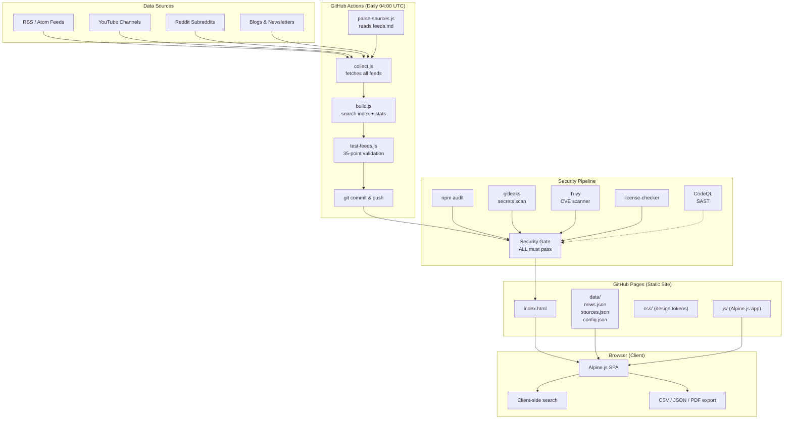
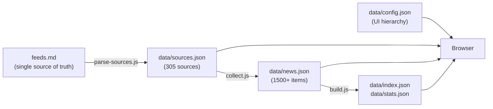

# Tech Update -- Architecture

## System Overview

Tech Update is a **zero-backend static site** that aggregates tech news from 300+ RSS feeds, YouTube channels, podcasts, and Reddit into a single searchable dashboard. It uses:

- **Alpine.js** for reactive UI (loaded from CDN)
- **Tailwind CSS** for styling (loaded from CDN)
- **No build step** -- pure HTML + JS served directly by GitHub Pages
- **feeds.md** as the single source of truth for all feed sources

All data collection happens server-side via Node.js scripts running in GitHub Actions. The browser fetches pre-built JSON and renders client-side.

---

## Architecture Diagram



---

## Data Flow



### Pipeline Steps

| Step | Script | Input | Output | Purpose |
|------|--------|-------|--------|---------|
| 1 | `parse-sources.js` | `feeds.md` | `data/sources.json` | Parse markdown into structured source registry |
| 2 | `collect.js` | `data/sources.json` | `data/news.json` | Fetch RSS/Atom/Reddit, deduplicate, generate TLDRs |
| 3 | `build.js` | `data/news.json` | `data/index.json`, `data/stats.json` | Build search index and statistics |
| 4 | `test-feeds.js` | All data files | Exit code 0/1 | 35-point validation suite |

---

## Feed Hierarchy

```mermaid
graph TD
    FM["feeds.md"] --> P["## Products"]
    FM --> T["## Topics"]
    FM --> X["## Cross-cutting Sources"]

    P --> AWS["### AWS"]
    P --> AZ["### Azure"]
    P --> TF["### Terraform"]
    P --> CF["### Cloudflare"]
    P --> DD["### Datadog"]
    P --> CL["### Claude"]
    P --> GE["### Gemini"]
    P --> OA["### OpenAI"]
    P --> GC["### GitHub Copilot"]
    P --> SL["### Slack"]
    P --> OB["### Obsidian"]
    P --> NO["### Notion"]
    P --> VS["### VS Code"]

    AWS --> AWSSEC["#### Security"]
    AWS --> AWSARCH["#### Architecture"]
    AWS --> AWSDEV["#### DevOps"]
    AWS --> AWSCOMP["#### Compute"]

    T --> SRE["### SRE"]
    T --> DO["### DevOps"]
    T --> SO["### SecOps"]
    T --> PE["### Platform Eng"]
    T --> SE["### Software Eng"]
    T --> AU["### Automation"]
    T --> OR["### Orchestration"]
    T --> CA["### Cloud Arch"]
    T --> SA["### Software Arch"]
```



---

## Directory Structure

```
Tech-Update/
|-- index.html                 Main SPA (Alpine.js)
|-- feeds.md                   Single source of truth for all feed sources
|-- js/
|   |-- app.js                 Alpine.js component: state, filtering, sorting
|   |-- tabs.js                Tab definitions, dynamic config loading
|   |-- search.js              Simple + advanced search, column filters
|   |-- export.js              CSV, JSON, PDF export
|   |-- theme.js               Dark/light theme toggle
|-- css/
|   |-- tokens.css             3-tier design token system
|   |-- style.css              Custom styles
|-- data/
|   |-- config.json            UI hierarchy (products, topics, software)
|   |-- sources.json           Generated source registry (from feeds.md)
|   |-- news.json              Collected news items
|   |-- index.json             Search index
|   |-- stats.json             Collection statistics
|   |-- archive/               Weekly data snapshots
|-- scripts/
|   |-- parse-sources.js       Reads feeds.md -> data/sources.json
|   |-- collect.js             Fetches feeds -> data/news.json
|   |-- build.js               Builds index + stats
|   |-- test-feeds.js          35-point test suite
|   |-- package.json           Dependencies (rss-parser)
|-- .github/
|   |-- workflows/
|   |   |-- collect.yml        Daily collection (04:00 UTC)
|   |   |-- security.yml       Daily security pipeline (gitleaks, Trivy, audit)
|   |   |-- pages.yml          Deploy to GitHub Pages (gated on security)
|   |   |-- codeql.yml         CodeQL SAST analysis
|   |   |-- scorecard.yml      OSSF Scorecard
|   |-- dependabot.yml         Daily dependency updates
|-- Documentation/
|   |-- SECURITY.md            Security model and policies
|   |-- DEPLOYMENT.md          Deployment guide
|   |-- CONTRIBUTING.md        Contribution guidelines
|-- products/                  Per-product source detail pages
|-- topics/                    Per-topic source detail pages
```

---

## Data Schemas

### news.json item

| Field | Type | Description |
|-------|------|-------------|
| `id` | string | SHA-256 hash (16 chars) of item URL |
| `title` | string | Article/post title |
| `url` | string | Link to original content |
| `source` | string | Source ID (matches sources.json) |
| `source_name` | string | Human-readable source name |
| `published` | string | ISO 8601 date |
| `tldr` | string | Auto-generated summary (up to 800 chars) |
| `version` | string/null | Extracted version string or null |
| `tags` | string[] | Product/topic IDs + `#type` content tags |
| `type` | string | Content type: article, video, podcast, etc. |

### sources.json source

| Field | Type | Description |
|-------|------|-------------|
| `id` | string | SHA-256 hash (16 chars) of source URL |
| `name` | string | Human-readable source name |
| `type` | string | blog, youtube, podcast, newsletter, forum, changelog |
| `url` | string | Website URL |
| `rss_url` | string/null | RSS/Atom feed URL |
| `tags` | string[] | Product/topic tags |

### feeds.md line format

```
- type | name | url | rss_url (optional)
```

Hierarchy is encoded in markdown headers:
- `## Products` / `## Topics` -- top-level category
- `### AWS` -- product/topic (becomes primary tag)
- `#### Security` -- sub-category (adds secondary tag)

---

## CDN Dependencies

| Library | CDN | Purpose |
|---------|-----|---------|
| Tailwind CSS | cdn.tailwindcss.com | Utility CSS |
| Alpine.js | cdn.jsdelivr.net | Reactive UI |
| jsPDF 2.5.2 | cdnjs.cloudflare.com | PDF export |
| jsPDF-AutoTable 3.8.4 | cdnjs.cloudflare.com | PDF tables |

All CDN scripts include SRI integrity hashes and are constrained by Content Security Policy.

---

## Search Architecture

Search is entirely client-side (`js/search.js`):

- **Simple search**: space-separated terms with implicit AND
- **Hash tags**: `#security`, `#video` match item tags exactly
- **Advanced builder**: field + operator + value with AND/OR logic
- **Column filters**: per-column include/exclude with regex support
- **Date presets**: today, this week, last 30 days, custom range

---

## Security Model

See [Documentation/SECURITY.md](Documentation/SECURITY.md) for full details. Key points:

- **No backend, no auth, no PII** -- minimal attack surface
- **Daily security pipeline**: gitleaks + Trivy + npm audit + license check
- **Security gate blocks deploy** -- nothing ships with known vulnerabilities
- **SRI hashes on all CDN scripts**
- **CSP meta tag** restricts resource loading
- **OSSF Scorecard** for public security posture grading
