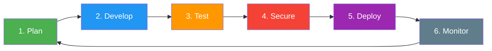
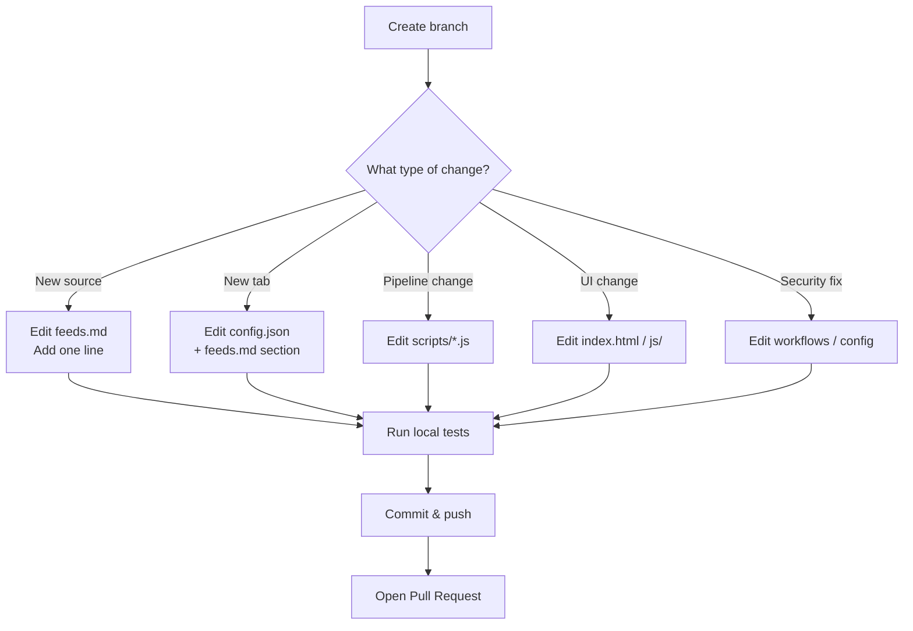
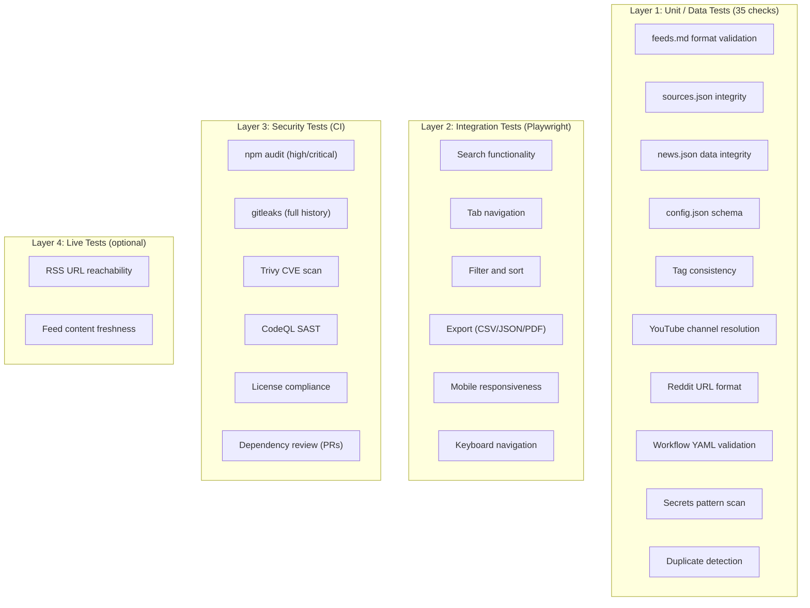
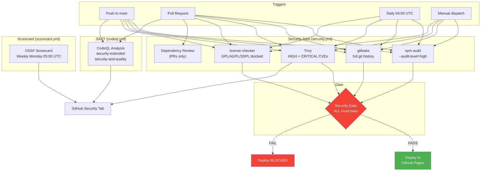
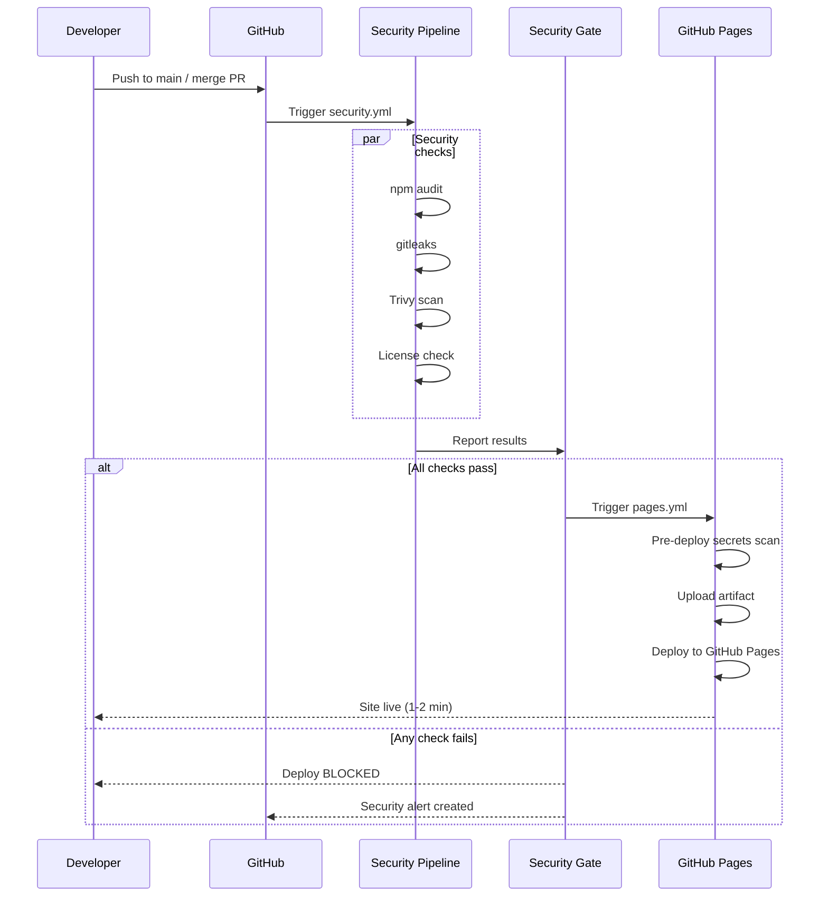
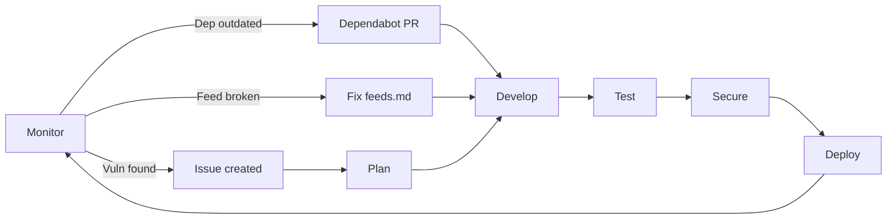
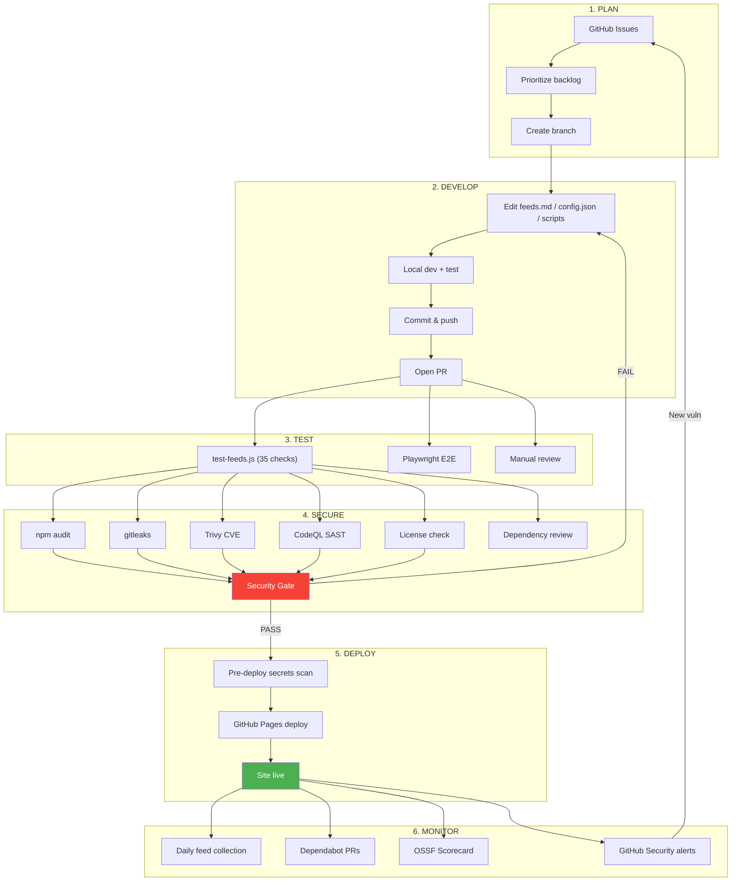

# Software Development Life Cycle (SDLC)

This document describes the full SDLC for Tech Update -- from ideation through deployment, monitoring, and feedback. It covers the engineering processes, security gates, testing strategy, and automation that ensure reliable, secure delivery.

---

## SDLC Overview

Tech Update follows a **continuous delivery** model with daily automated deployments gated by a comprehensive security pipeline. The cycle has six phases:



---

## Phase 1: Plan

### Inputs
- Feature requests (GitHub Issues)
- Security advisories (Dependabot, Trivy, CodeQL)
- Feed source suggestions
- OSSF Scorecard recommendations

### Activities
- Define requirements in GitHub Issues
- Assign labels: `feature`, `fix`, `sources`, `security`, `docs`, `ci`
- Prioritize in project board

### Outputs
- Labeled, prioritized backlog
- Branch created from `main` using naming convention

### Branch Naming

| Prefix | Purpose |
|--------|---------|
| `feature/*` | New functionality |
| `fix/*` | Bug fixes |
| `chore/*` | Maintenance, deps, CI |
| `docs/*` | Documentation only |
| `sources/*` | Adding/updating feed sources |
| `security/*` | Security fixes |

---

## Phase 2: Develop

### Inputs
- Branch from Phase 1
- `feeds.md` for source changes
- `data/config.json` for UI changes
- `scripts/` for pipeline changes

### Activities



### Local Development

```bash
# Install dependencies (first time)
cd scripts && npm ci

# Parse feeds and collect news
npm run full

# Run test suite
npm test

# Run with verbose output
npm run test:verbose

# Test RSS reachability (slow, hits all URLs)
npm run test:live
```

### Code Standards
- ES modules (`import`/`export`)
- No `eval()`, `new Function()`, or implied eval (enforced by ESLint)
- Alpine.js `x-text` only (never `x-html`) for feed content
- SRI hashes on all CDN scripts
- No secrets or credentials in code

---

## Phase 3: Test

### Test Strategy

Tech Update has **four layers** of testing:



### Test Suite Details (`scripts/test-feeds.js`)

| # | Test | What it checks | Blocking? |
|---|------|----------------|-----------|
| 1 | feeds.md format | All 321 feed lines have valid `type \| name \| url` format | Yes |
| 2 | feeds.md sections | Products and Topics headers exist, required products present | Yes |
| 3 | sources.json total | `total` field matches actual array length | Yes |
| 4 | sources.json fields | Every source has `id`, `name`, `type`, `url`, `tags` | Yes |
| 5 | sources.json no duplicate IDs | SHA-256 IDs are unique | Yes |
| 6 | sources.json no duplicate URLs | Normalized URLs are unique | Yes |
| 7 | sources.json valid types | All types are blog/youtube/podcast/newsletter/forum/changelog | Yes |
| 8 | news.json exists | File is present and parseable | Yes |
| 9 | news.json items | All items have `id`, `title`, `url`, `source_name` | Yes |
| 10 | news.json no duplicates | No duplicate item IDs | Yes |
| 11 | news.json freshness | At least some items from last 30 days | Yes |
| 12 | config.json schema | products/topics/software arrays exist with required fields | Yes |
| 13 | config.json children | All children have `id` and `label` | Yes |
| 14 | Tag consistency | All source tags exist in config.json | Yes |
| 15 | Orphan tag check | Config tags without sources (warning only) | No |
| 16 | YouTube RSS resolution | All YouTube sources have channel ID RSS URLs | Yes |
| 17 | YouTube RSS format | URLs match `youtube.com/feeds/videos.xml?channel_id=` | Yes |
| 18 | Reddit JSON endpoints | All Reddit sources have `.json?limit=25` URLs | Yes |
| 19-22 | Workflow YAML | collect/pages/security/codeql.yml exist with name/on/jobs | Yes |
| 23 | Security gate | security.yml has security-gate job | Yes |
| 24 | Deploy gate | pages.yml uses workflow_run trigger | Yes |
| 25 | Audit blocking | collect.yml npm audit has no `\|\| true` | Yes |
| 26-30 | Secrets patterns | No AWS keys, OpenAI keys, GitHub PATs, passwords in code | Yes |

### Running Tests

```bash
# Quick (offline, ~1 second)
cd scripts && npm test

# Verbose (shows details per test)
npm run test:verbose

# Live (tests RSS URL reachability -- takes ~2 minutes)
npm run test:live
```

---

## Phase 4: Secure

### Security Pipeline Architecture



### Security Tools

| Tool | What it does | Severity threshold | Schedule |
|------|-------------|-------------------|----------|
| **npm audit** | Checks npm dependencies for known CVEs | HIGH / CRITICAL | Every push, PR, daily |
| **gitleaks** | Scans full git history for leaked secrets | Any match | Every push, PR, daily |
| **Trivy** | Filesystem vulnerability scan for CVEs | HIGH / CRITICAL | Every push, PR, daily |
| **CodeQL** | Static application security testing (SAST) | security-extended | Every push, PR, weekly |
| **license-checker** | Blocks GPL/AGPL/SSPL/EUPL licenses | Any match | Every push, PR, daily |
| **Dependency Review** | Reviews new deps in PRs for vulns | HIGH / deny GPL | PRs only |
| **OSSF Scorecard** | Overall repo security posture grade | Advisory | Weekly |
| **Dependabot** | Auto-creates PRs for outdated deps | All severities | Daily |

### Security Gate Rules

The deploy to GitHub Pages **only proceeds** if:

1. `dependency-audit` job: **SUCCESS**
2. `secrets-scan` job: **SUCCESS**
3. `trivy-scan` job: **SUCCESS**
4. `license-check` job: **SUCCESS**

If **any** of these fail, the security gate fails and no deployment occurs.

---

## Phase 5: Deploy

### Deployment Flow



### Deployment Triggers

| Trigger | Security gate | Deploy |
|---------|--------------|--------|
| Push to `main` | Required (auto) | After security passes |
| Pull Request merge | Required (auto) | After security passes |
| Manual `workflow_dispatch` on pages.yml | Bypassed | Immediate |
| Daily collection commit | Required (auto) | After security passes |

### Rollback

Since the site is static with no database:
- **Revert commit**: `git revert <sha>` and push
- **Data rollback**: weekly snapshots in `data/archive/`
- **Emergency**: manually trigger pages.yml to redeploy any commit

---

## Phase 6: Monitor

### What is Monitored

| Signal | Source | Frequency |
|--------|--------|-----------|
| Feed collection success | GitHub Actions logs | Daily |
| Data freshness (items < 30 days) | `test-feeds.js` | Every collection run |
| Security vulnerabilities | Trivy + npm audit + CodeQL | Daily |
| Dependency updates available | Dependabot PRs | Daily |
| Repo security posture | OSSF Scorecard | Weekly |
| Secrets exposure | gitleaks | Every push |

### Alerts

- **Dependabot**: auto-creates PRs for vulnerable dependencies
- **CodeQL**: creates security alerts in GitHub Security tab
- **Trivy**: uploads SARIF to GitHub Security tab
- **OSSF Scorecard**: publishes results to OpenSSF

### Feedback Loop



---

## Complete SDLC Lifecycle



---

## Environments

| Environment | URL | Trigger | Security gate |
|-------------|-----|---------|---------------|
| **Local** | `localhost` (open index.html) | Manual | None (use `npm test`) |
| **PR Preview** | N/A (static site) | PR opened | Full security pipeline |
| **Production** | GitHub Pages URL | Push to main | Full security pipeline + deploy gate |

---

## Tools Summary

| Category | Tool | Purpose |
|----------|------|---------|
| **Language** | JavaScript (ES modules, Node.js 20) | Pipeline scripts |
| **Frontend** | Alpine.js + Tailwind CSS | Reactive SPA |
| **CI/CD** | GitHub Actions | Automation |
| **Security** | gitleaks, Trivy, CodeQL, npm audit, OSSF Scorecard | DevSecOps |
| **Dependencies** | Dependabot (daily) | Version management |
| **Testing** | Custom test suite (test-feeds.js), Playwright | Validation |
| **Hosting** | GitHub Pages | Static site delivery |
| **Data** | RSS/Atom feeds, Reddit JSON | Content aggregation |
| **Package** | rss-parser | Feed parsing |

---

## Compliance Matrix

| Standard | Status | Notes |
|----------|--------|-------|
| OWASP Top 10 | Pass (9/10 N/A or Pass) | Static site eliminates most categories |
| Supply chain (SLSA) | Partial | SRI hashes, Dependabot, SBOM generation |
| Secrets management | Pass | gitleaks + pre-deploy scan + .gitignore |
| License compliance | Pass | GPL/AGPL/SSPL/EUPL blocked |
| Accessibility (WCAG 2.1 AA) | Partial | ARIA landmarks, skip nav, keyboard accessible |

---

## Diagram Files

- **Mermaid**: All diagrams in this document render natively on GitHub
- **draw.io**: See [`Documentation/sdlc.drawio`](sdlc.drawio) for an editable version of the SDLC lifecycle diagram
