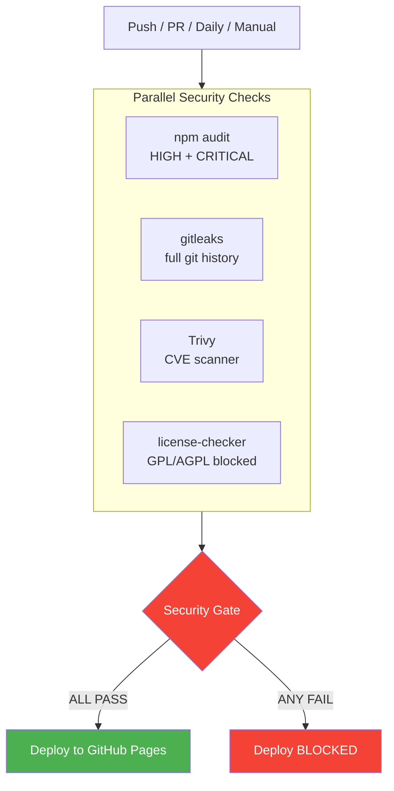

# Security Model

This document describes the security posture of Tech Update, a static tech news aggregator built with Alpine.js, Tailwind CSS, and GitHub Pages.

---

## Architecture Security

Tech Update is a **static site** with no server-side code, no backend API, no authentication system, and no database. This eliminates entire classes of vulnerabilities:

- **No backend** -- No server-side injection, session management, or misconfiguration
- **No authentication** -- No credentials, sessions, or tokens
- **No PII** -- No forms, accounts, or analytics cookies
- **No user-generated content** -- All content from RSS feeds via automated pipeline

The attack surface is limited to static files on GitHub Pages and the CI/CD pipeline.

---

## DevSecOps Pipeline

### Security Pipeline (`security.yml`)

Runs on **every push, every PR, and daily at 04:00 UTC**.



### Security Tools

| Tool | Purpose | Threshold | Schedule |
|------|---------|-----------|----------|
| **npm audit** | Dependency CVEs | HIGH / CRITICAL | Push, PR, daily |
| **gitleaks** | Leaked secrets in git history | Any match | Push, PR, daily |
| **Trivy** | Filesystem vulnerability scan | HIGH / CRITICAL | Push, PR, daily |
| **CodeQL** | Static application security testing | security-extended | Push, PR, weekly |
| **license-checker** | License compliance | GPL/AGPL/SSPL/EUPL blocked | Push, PR, daily |
| **Dependency Review** | New dep review in PRs | HIGH, deny GPL | PRs only |
| **OSSF Scorecard** | Repo security posture grade | Advisory | Weekly |
| **Dependabot** | Auto-PRs for outdated deps | All severities | Daily |

### Security Gate

The deploy to GitHub Pages **only proceeds** when ALL of these pass:
1. `dependency-audit`: SUCCESS
2. `secrets-scan`: SUCCESS
3. `trivy-scan`: SUCCESS
4. `license-check`: SUCCESS

### Deploy Gate

`pages.yml` uses `workflow_run` to trigger only after the Security Pipeline completes successfully. Additionally, a pre-deploy secrets pattern scan runs as a final check.

---

## CDN Security

### Subresource Integrity (SRI)

All CDN scripts include `integrity` attributes with SHA-384 hashes:
- `jspdf.umd.min.js`
- `jspdf.plugin.autotable.min.js`
- `@alpinejs/collapse`
- `alpinejs`

### Content Security Policy (CSP)

```
default-src 'self';
script-src  'self' cdn.tailwindcss.com cdn.jsdelivr.net cdnjs.cloudflare.com 'unsafe-eval';
style-src   'self' 'unsafe-inline' cdn.tailwindcss.com;
img-src     'self' data:;
connect-src 'self';
font-src    'self';
```

Note: `unsafe-eval` is required by Tailwind's browser JIT. No user input reaches `eval()`.

---

## RSS Feed Injection Prevention

1. **Server-side**: `collect.js` stores feed data as plain text fields
2. **Client-side**: Alpine.js `x-text` auto-escapes HTML entities. `x-html` is never used for feed content.

---

## Data Integrity

- **Git-tracked** -- full audit trail on all changes
- **Pipeline-validated** -- 35-point test suite (`test-feeds.js`) runs before every commit
- **Bot commits** -- automated changes use `github-actions[bot]` identity

---

## Dependabot Configuration

| Ecosystem | Directory | Schedule | PR Limit | Grouping |
|-----------|-----------|----------|----------|----------|
| npm | `/scripts` | Daily | 10 | Minor + patch grouped |
| npm | `/agents/browser` | Daily | 5 | Minor + patch grouped |
| github-actions | `/` | Daily | 5 | All grouped |

---

## Branch Protection

Recommended protections for `main`:

- Require PR reviews (1 approval minimum)
- Require status checks: Security Pipeline, CodeQL
- Require branches up to date
- No force pushes
- No deletions

---

## Sensitive Files

The following are excluded from the public repo via `.gitignore`:

| Pattern | Reason |
|---------|--------|
| `.henry/` | Personal engineering notes |
| `.security/` | Internal security audit artifacts |
| `.claude/` | Claude Code local settings |
| `memory.md`, `workflow.md`, `nice_to_have.md` | Internal planning docs |
| `agents/reports/` | Transient test results |
| `agents/browser/test-results/` | Playwright artifacts |

---

## Vulnerability Reporting

1. **Do not open a public issue.**
2. Open a **private security advisory** via GitHub Security tab.
3. Include: description, reproduction steps, impact, suggested fix.
4. Maintainer acknowledges within 48 hours, fix within 7 days.

---

## OWASP Top 10

| Category | Status | Notes |
|----------|--------|-------|
| A01: Broken Access Control | N/A | Public static site |
| A02: Cryptographic Failures | Pass | No sensitive data |
| A03: Injection | Pass | `x-text` escaping, no server-side |
| A04: Insecure Design | Pass | Static architecture |
| A05: Security Misconfiguration | Pass | CSP, SRI, minimal CI permissions |
| A06: Vulnerable Components | Pass | Dependabot + audit + Trivy + daily scans |
| A07: Authentication | N/A | No auth system |
| A08: Integrity Failures | Pass | SRI, git-tracked data, pipeline validation |
| A09: Logging/Monitoring | Pass | GH Actions logs, git history, OSSF Scorecard |
| A10: SSRF | N/A | No server-side requests in production |

---

## Compliance Summary

| Standard | Status |
|----------|--------|
| OWASP Top 10 | Pass (9/10 N/A or Pass) |
| Supply chain (SLSA) | Partial (SRI, Dependabot, SBOM) |
| Secrets management | Pass (gitleaks + pre-deploy + .gitignore) |
| License compliance | Pass (GPL/AGPL/SSPL/EUPL blocked) |
| WCAG 2.1 AA | Partial (ARIA, skip nav, keyboard) |
