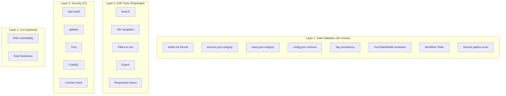

# Testing Guide

This document describes the testing strategy, test suite, and how to run tests for Tech Update.

---

## Test Layers



---

## Quick Start

```bash
cd scripts

# Run all offline tests (~1 second)
npm test

# Run with detailed output per test
npm run test:verbose

# Run including live RSS reachability checks (~2 minutes)
npm run test:live
```

---

## Test Suite: `scripts/test-feeds.js`

### Usage

```
node test-feeds.js              # All offline tests
node test-feeds.js --verbose    # Detailed output
node test-feeds.js --live       # Include RSS URL reachability
```

### Test Inventory

| # | Test | Category | What it checks |
|---|------|----------|---------------|
| 1 | feeds.md exists | Format | File is present |
| 2 | feeds.md entry count | Format | At least 100 feed entries |
| 3 | feeds.md line format | Format | All lines match `type \| name \| url` with valid types |
| 4 | feeds.md sections | Format | `## Products` and `## Topics` headers exist |
| 5 | feeds.md products | Format | Required products (AWS, Azure, Terraform, etc.) present |
| 6 | sources.json exists | Integrity | File is present and parseable |
| 7 | sources.json total | Integrity | `total` field matches array length |
| 8 | sources.json timestamp | Integrity | `generated` field exists |
| 9 | sources.json fields | Integrity | Every source has id, name, type, url, tags |
| 10 | sources.json unique IDs | Duplicates | No duplicate SHA-256 IDs |
| 11 | sources.json unique URLs | Duplicates | No duplicate normalized URLs |
| 12 | sources.json types | Schema | All types are valid (blog/youtube/podcast/newsletter/forum/changelog) |
| 13 | news.json exists | Data | File is present |
| 14 | news.json items | Data | Items array exists with entries |
| 15 | news.json fields | Data | All items have id, title, url, source_name |
| 16 | news.json unique IDs | Duplicates | No duplicate item IDs |
| 17 | news.json freshness | Freshness | Items from last 30 days exist |
| 18 | config.json exists | Schema | File is present |
| 19 | config.json products | Schema | Products array exists |
| 20 | config.json topics | Schema | Topics array exists |
| 21 | config.json software | Schema | Software array exists |
| 22 | config.json children | Schema | All children have id and label |
| 23 | Tag cross-reference | Consistency | All source tags exist in config.json |
| 24 | Orphan tags | Consistency | Warn for config tags with no sources |
| 25 | YouTube RSS | Resolution | All YouTube sources have RSS URLs |
| 26 | YouTube format | Resolution | RSS URLs match expected pattern |
| 27 | Reddit JSON | Resolution | All Reddit sources have .json endpoints |
| 28-31 | Workflow existence | CI | collect/pages/security/codeql.yml exist |
| 32 | Security gate | CI | security.yml has security-gate job |
| 33 | Deploy gate | CI | pages.yml uses workflow_run trigger |
| 34 | Audit blocking | CI | collect.yml npm audit has no `\|\| true` |
| 35 | Secrets scan | Security | No AWS keys, OpenAI keys, GitHub PATs, passwords |

### Exit Codes

| Code | Meaning |
|------|---------|
| 0 | All tests passed |
| 1 | One or more tests failed |

---

## E2E Tests (Playwright)

Located in `agents/browser/tests/`. Run with:

```bash
cd agents/browser
npm ci
npx playwright test
```

### Test Specs

| File | Tests |
|------|-------|
| `search.spec.js` | Simple search, hash tag search, advanced query builder |
| `tabs.spec.js` | Tab navigation, sub-tab filtering, section expansion |
| `export.spec.js` | CSV, JSON, PDF export with filtered data |
| `responsive.spec.js` | Mobile layout, sidebar collapse, card view |

---

## CI Test Integration

Tests run automatically in two places:

### 1. Daily Collection Pipeline (`collect.yml`)

```yaml
- name: Run test suite
  run: cd scripts && node test-feeds.js
```

Runs after `parse-sources.js`, `collect.js`, and `build.js`. If any test fails, the pipeline stops and no data is committed.

### 2. Security Pipeline (`security.yml`)

Runs npm audit, gitleaks, Trivy, CodeQL, and license-checker. All must pass for the security gate to open.

---

## Adding New Tests

To add a test to `test-feeds.js`:

1. Create a function following the pattern:
   ```js
   function testMyNewCheck() {
     console.log('\n--- My new check ---');
     // ... validation logic ...
     if (ok) pass('Check passed');
     else fail('Check failed', 'reason');
   }
   ```

2. Call it in the main block at the bottom of the file.

3. Use `log()` for verbose-only output, `pass()` / `fail()` / `skip()` for results.

---

## Test Data

Tests read these files (relative to repo root):

| File | Required by |
|------|-------------|
| `feeds.md` | Format validation |
| `data/sources.json` | Integrity, tags, YouTube, Reddit |
| `data/news.json` | Data integrity, freshness |
| `data/config.json` | Schema, tag consistency |
| `.github/workflows/*.yml` | Workflow validation |
| `scripts/*.js`, `index.html` | Secrets scan |
