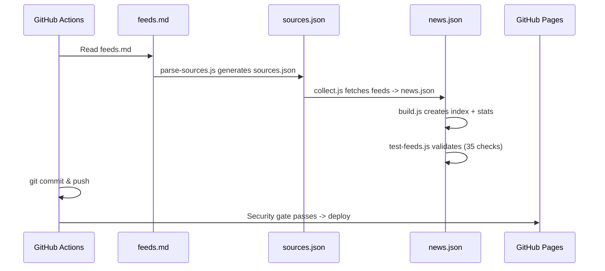

# Tech Update -- How to Add Things

A practical guide for adding sources, products, sub-tabs, and sections.

---

## Adding a New Source (Most Common)

A "source" is an RSS feed, blog, YouTube channel, podcast, or newsletter. **All sources are defined in one file: `feeds.md`.**

### Steps

1. Open `feeds.md` in any text editor.

2. Find the right section (e.g., `### AWS` under `## Products`, or `### DevOps` under `## Topics`).

3. Add a line in this format:

   ```
   - type | name | url | rss_url
   ```

   - `type`: `blog`, `youtube`, `podcast`, `newsletter`, `forum`, or `changelog`
   - `name`: human-readable name
   - `url`: main website URL
   - `rss_url`: optional RSS/Atom feed URL (omit if none)

4. For **YouTube** channels, use the `@handle` URL. The channel ID is resolved automatically:
   ```
   - youtube | Fireship | https://www.youtube.com/@Fireship
   ```

5. For **Reddit** subreddits, use the full subreddit URL. The `.json` endpoint is built automatically:
   ```
   - forum | r/aws | https://www.reddit.com/r/aws/
   ```

6. Run locally to test:
   ```bash
   cd scripts
   node parse-sources.js   # Generates data/sources.json
   node test-feeds.js      # Validates everything
   ```

7. Or just commit -- the daily pipeline picks it up at 06:00 SAST.

### Example: Adding an AWS Security Blog

Add this line under `### AWS` > `#### Security` in `feeds.md`:

```
- blog | AWS Container Security Blog | https://aws.amazon.com/blogs/containers/ | https://aws.amazon.com/blogs/containers/feed/
```

It will automatically:
- Get the `aws` tag (from `### AWS` header)
- Appear under the AWS tab and its sub-tabs
- Be collected on the next daily run

---

## Adding a New YouTube Channel

1. Add the channel to `feeds.md` under the right product/topic:
   ```
   - youtube | New Channel | https://www.youtube.com/@ChannelHandle
   ```

2. Add the channel ID mapping to `scripts/parse-sources.js` in the `YOUTUBE_CHANNELS` object:
   ```js
   '@ChannelHandle': 'UCxxxxxxxxxxxxxxxxxxxxxx',
   ```

   To find a channel ID: go to the channel page, view page source, search for `channelId`.

3. Test: `cd scripts && node parse-sources.js && node test-feeds.js`

---

## Adding a New Product (Top-Level Tab)

### Steps

1. **Edit `data/config.json`** -- add to the `"products"` array:
   ```json
   { "id": "kubernetes", "label": "Kubernetes", "icon": "...", "tags": ["kubernetes"] }
   ```

2. **Edit `feeds.md`** -- add a new `### Kubernetes` section under `## Products` with sources:
   ```markdown
   ### Kubernetes

   - blog | Kubernetes Blog | https://kubernetes.io/blog/ | https://kubernetes.io/feed.xml
   - youtube | CNCF | https://www.youtube.com/@cncf
   - forum | r/kubernetes | https://www.reddit.com/r/kubernetes/
   ```

3. **Run** `cd scripts && node parse-sources.js && node test-feeds.js`

4. **Commit and push.** Tab appears on next page load; news arrives on next collection run.

---

## Adding a Sub-Tab (Child Tab)

Sub-tabs provide granular filtering under a parent product.

1. **Edit `data/config.json`** -- add to the parent's `"children"` array:
   ```json
   {
     "id": "aws-lambda",
     "label": "Lambda",
     "icon": "...",
     "tags": ["aws"],
     "filter_source": "AWS Lambda Blog"
   }
   ```

2. **Edit `feeds.md`** -- add a `####` sub-section under the parent:
   ```markdown
   #### Lambda

   - blog | AWS Lambda Blog | https://aws.amazon.com/blogs/compute/
   ```

3. The `filter_source` field matches against `source_name` in news items, so items must come from a source whose name contains that string.

---

## Adding a New Section

Sections are the top-level groupings (Products, Topics, Software). This requires code changes in four files -- see [ARCHITECTURE.md](ARCHITECTURE.md) for details.

---

## Quick Reference

| You want to... | Do this |
|---|---|
| Track a new blog/feed/channel | Add one line to `feeds.md` |
| Add a new top-level tab | Add to `config.json` + new `###` section in `feeds.md` |
| Add a sub-tab under a product | Add to `config.json` children + `####` section in `feeds.md` |
| Test your changes | `cd scripts && npm test` |
| Run collection manually | `cd scripts && npm run full` |

## File Locations

| What | File |
|---|---|
| All feed sources | `feeds.md` |
| UI tabs and hierarchy | `data/config.json` |
| YouTube channel IDs | `scripts/parse-sources.js` (YOUTUBE_CHANNELS) |
| Collection schedule | `.github/workflows/collect.yml` |
| Generated source data | `data/sources.json` (do not edit directly) |

---

## How the Site Rebuilds



### When Do Changes Take Effect?

| Change | When it appears |
|---|---|
| Edit `feeds.md` (new source) | Next daily collection run (06:00 SAST) |
| Edit `config.json` (new tab) | Next page load after push to main |
| Edit `index.html` or `js/` | Next page load after push to main |
