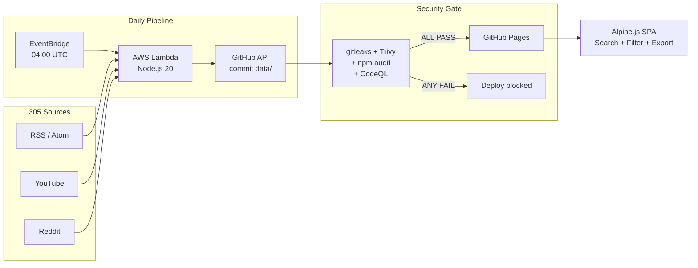

# Tech Update

A daily tech news dashboard that aggregates 300+ sources across RSS feeds, YouTube, podcasts, newsletters, and Reddit into a single searchable interface.

## What it does

- Collects news from **305 curated sources** covering AWS, Azure, Terraform, Cloudflare, Datadog, Claude, OpenAI, Gemini, GitHub Copilot, and more
- Covers **9 engineering topics**: SRE, DevOps, SecOps, Platform Engineering, Software Engineering, Automation, Orchestration, Cloud Architecture, Software Architecture
- Runs a daily **AWS Lambda** pipeline that fetches all feeds, deduplicates, generates summaries, and commits to this repo
- Serves a **static Alpine.js SPA** via GitHub Pages with search, filtering, sorting, and CSV/JSON/PDF export
- Gated by a **DevSecOps pipeline** (Trivy, gitleaks, CodeQL, npm audit) -- nothing deploys with known vulnerabilities

## Architecture



## Quick Start

### Add a new source

Edit `feeds.md` and add one line:

```
- blog | My New Blog | https://example.com | https://example.com/feed.xml
```

See [HOW_TO_ADD.md](HOW_TO_ADD.md) for full guide.

### Run locally

```bash
cd scripts
npm ci
npm run full       # Parse feeds.md + collect + build
npm test           # 35-point validation suite
npm run test:live  # Also test RSS reachability
```

### Deploy the Lambda

```bash
cd lambda
./deploy.sh        # SAM guided deploy (first time)
```

See [lambda/README.md](lambda/README.md) for details.

## How it works

| Step | What | Where |
|------|------|-------|
| 1 | All feed sources defined in markdown | [`feeds.md`](feeds.md) |
| 2 | Lambda parses feeds, collects RSS, builds index | [`lambda/`](lambda/) |
| 3 | Data committed to repo via GitHub API | [`data/`](data/) |
| 4 | Security pipeline validates the commit | [`.github/workflows/security.yml`](.github/workflows/security.yml) |
| 5 | GitHub Pages deploys if security passes | [`.github/workflows/pages.yml`](.github/workflows/pages.yml) |
| 6 | Browser loads static JSON and renders | [`index.html`](index.html) + [`js/`](js/) |

## Documentation

| Document | Contents |
|----------|----------|
| [ARCHITECTURE.md](ARCHITECTURE.md) | System design, data flow, schemas, diagrams |
| [HOW_TO_ADD.md](HOW_TO_ADD.md) | Adding sources, products, tabs |
| [Documentation/SDLC.md](Documentation/SDLC.md) | Full SDLC with mermaid diagrams + draw.io |
| [Documentation/SECURITY.md](Documentation/SECURITY.md) | Security model, pipeline, OWASP compliance |
| [Documentation/TESTING.md](Documentation/TESTING.md) | Test strategy, 35-point test inventory |
| [Documentation/DEPLOYMENT.md](Documentation/DEPLOYMENT.md) | GitHub Pages + Lambda deployment |
| [lambda/README.md](lambda/README.md) | Lambda setup, deploy, cost comparison |

## Tech Stack

| Layer | Tool |
|-------|------|
| Frontend | Alpine.js + Tailwind CSS (CDN) |
| Data pipeline | Node.js 20 (parse-sources.js, collect.js, build.js) |
| Collection runtime | AWS Lambda (EventBridge daily cron) |
| Hosting | GitHub Pages (static) |
| Security | gitleaks, Trivy, CodeQL, npm audit, OSSF Scorecard |
| Dependencies | Dependabot (daily), rss-parser |
| Testing | 35-point custom suite + Playwright E2E |

## License

See [LICENSE](LICENSE).
